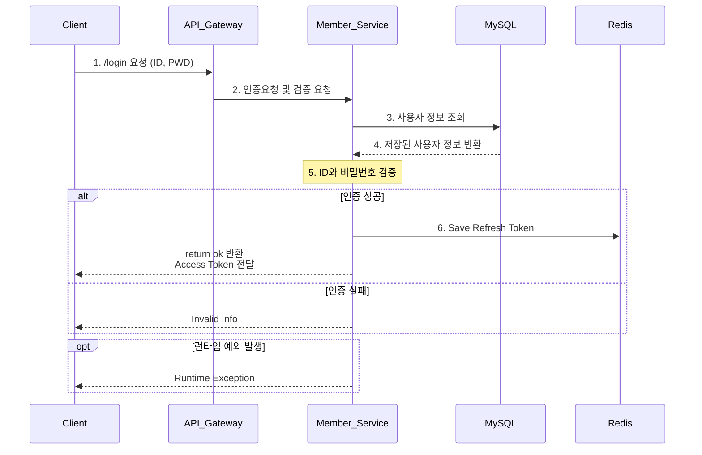
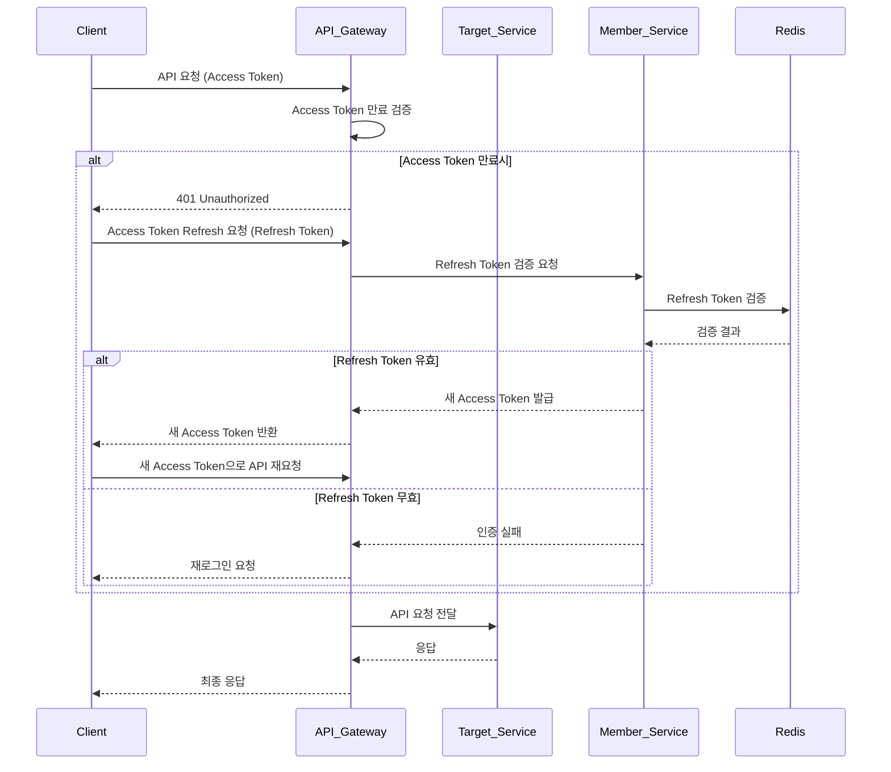

# KOSPI 주식 종목 토론 커뮤니티 프로젝트
프로젝트 기간 : 24/08/11 ~ 24/12

- 사용자들이 KOSPI 주식 종목에 대한 의견을 나눌 수 있는 가상 주식 커뮤니티의 백엔드 API
- 대규모 사용자 증가나 실시간 데이터 처리와 같은 상황에서도 유연하게 확장할 수 있도록 **Service-Oriented-Architecture**(**SOA**)로 설계하였으며, **도커 컴포즈**를 활용해 여러 서비스를 쉽게 관리하고 배포할 수 있도록 하였습니다.
- Docker 환경을 통해 일관된 개발 및 배포 방식을 적용함으로써, 환경 간 차이를 줄여 안정적인 운영을 추구하고 있습니다.
  
## 유저 플로우
- 유저는 회원 가입을 통해 서비스의 주요 기능을 이용할 수 있습니다.
- 종목에 관한 뉴스피드 화면에서 유저는 포스트를 작성하고, 댓글과 좋아요를 통해 다른 사용자들과 상호작용할 수 있습니다.

## Architecture

## Tech

|  | Tech           | Usage                                           |
|--|----------------|-------------------------------------------------|
|**Language** | Java 17   |                                          |
|**Framework**|SpringBoot 3.3.3 |                    |
|**Build**| Gradle     | 빌드툴                                    |
|**Database** | MySQL   | 관계형 데이터베이스                         |
|**Database** | Redis | |
|**ORM**|Spring Data JPA         |                                  |
|**VCS**| Git  | 버전관리            |
 | **Message Broker** | Kafka | 서비스 간 데이터 통신 (이벤트 기반) |
| **API Gateway** | Spring Cloud Gateway | API 라우팅 및 필터링 |
|**Container** | Docker | WAS 및 마이크로서비스에 필요한 의존성 컨테이너 구동 |
| **Service Discovery** | Spring Cloud Netflix Eureka | 서비스 디스커버리 및 로드 밸런싱 |

## 주요 기능 및 API
| 마이크로서비스            | 기능                                                             |
|--------------------------|----------------------------------------------------------------|
| **API Gateway Service**   | API 단일 진입점, 라우팅 기능, 토큰 검증                                                |
| **Registry Service**      | 서비스 디스커버리 및 로드밸런싱 기능 제공                                            |
| **User Service**          | 회원 가입, 개인정보 업데이트, 로그인, 로그아웃 API 제공                                |
| **Activity Service**      | 포스트 작성, 댓글 작성, 좋아요 클릭 API 제공                                           |
| **Newsfeed Service**      | 활동 데이터를 카프카로 전송하여 뉴스피드 아이템 구성                                     |
| **Stock Service**         | 관심 종목 팔로우, 종목 정보 관리 API 제공                                           |

## ERD 

# 주요 시퀀스

## 로그인 시퀀스 다이어그램

1. 클라이언트가 API Gateway 에 로그인 요청을 보낸다.
2. API Gateway 가 Member Service 에 인증 및 검증을 요청한다.
3. Member Service는 MySQL에서 사용자 정보를 조회한다.
4. MySQL 이 저장된 사용자 정보를 Member Service에 반환한다.
5. Member Service는 내부적으로 전달받은 ID와 비밀번호를 DB에서 조회한 정보와 비교하여 검증한다.
6. 인증 결과에 따라 Member Service가 직접 클라이언트에 응답한다 : 
   - 인증 성공: Redis에 리프레시 토큰 저장 후, 클라이언트에 'ok' 반환 및 액세스 토큰 전달
   - 인증 실패: 클라이언트에 유효하지 않은 정보 반환
7. 런타임 예외 발생 시 Member Service가 클라이언트에 직접 예외를 반환한다.

## 타 서비스 API 요청에 대한 검증 프로세스

### API 요청 및 인증 시나리오

1. 클라이언트가 Access Token과 함께 API 요청을 API Gateway로 전달한다.
2. API Gateway는 Access Token의 만료 여부를 검증한다.
3. Access Token이 만료된 경우:
   - API Gateway는 클라이언트에게 401 Unauthorized 응답을 전달한다.
   - 클라이언트는 API Gateway로 Access Token을 Refresh하기 위한 요청을 전달한다. (이때 Refresh Token을 함께 포함한다.)
   - API Gateway는 이 요청을 Member Service로 전달한다.
   - Member Service는 Redis에서 Refresh Token의 유효성을 검증한다.
   
4. Refresh Token이 유효한 경우:
   - Member Service는 새로운 Access Token을 발급한다. (새로운 Refresh Token은 저장하지 않는다.)
   - 클라이언트는 새 Access Token으로 API 요청을 다시 전달한다.

5. Refresh Token이 무효한 경우:
   - 클라이언트에게 재로그인을 요청한다.

6. Access Token이 유효하거나 재인증이 완료된 후:
   - API Gateway는 Target Service에 API 요청을 전달한다.
   - Target Service는 응답을 반환한다.
   - API Gateway는 클라이언트에게 최종 응답을 전달한다.

## 트러블 슈팅
**인증/인가 트러블 슈팅 관련** : [멤버 서비스 시퀀스 다이어그램 바로 보기](https://github.com/1seyoung/Anteater/blob/main/member-service/README_MEMBER_SERVICE.md)
<H3>인증/인가(1) : Member Service: 회원 관리와 인증 기능 통합 사례</H3>

****문제 정의****

**문제:**
회원 관리(회원 가입, 개인정보 수정 등)와 인증/인가(토큰 발급 및 검증) 기능을 어떻게 효과적으로 결합할 것인지 고민이 있었음. 두 기능이 밀접하게 관련되어 있어 별도 서비스로 분리하는 대신, 하나의 Member Service에 통합하여 관리하기로 결정했으나, 이를 통해 생길 수 있는 확장성 및 유지보수 문제를 고려해야 했음.

****원인 분석****

- 유저 관련 기능과 인증/인가 기능이 밀접하게 연결되어 있으므로, 두 기능을 별도로 분리하기보다는 하나의 서비스로 통합하는 것이 더 효율적일 수 있다고 판단.
- 별도의 인증 서비스를 두는 경우, 서비스 간 통신 및 데이터 동기화 문제가 발생할 수 있다고 생각하여 Member Service에 모든 기능을 통합.
- 그러나 통합된 서비스의 규모가 커질 경우, 서비스 복잡성이 증가하고 유지보수가 어려워질 가능성을 우려.

****해결 방법****

**Member Service 통합 설계:**
- 회원 관리와 인증/인가 기능을 Member Service로 통합하여 관리. 이를 통해 서비스 간 불필요한 통신을 최소화하고, 데이터 일관성을 쉽게 유지할 수 있도록 함.
- 회원 가입, 개인정보 수정, 로그인, 로그아웃과 같은 기능뿐 아니라, 토큰 발급 및 검증 등의 인증 기능도 하나의 서비스에서 처리.

**API Gateway에서의 인가 체크:**
- API Gateway에서 각 요청이 Member Service로 전달되기 전에 JWT 토큰 검증을 통해 인가(Authorization)를 처리하도록 설계.
- 게이트웨이에서 인가 필터를 추가하여, 유효한 토큰을 확인한 후 요청을 Member Service로 전달.
- 이를 통해 서비스 통합은 이루었지만, 인가는 중앙 집중화된 게이트웨이에서 효율적으로 관리.

**서비스 복잡성 관리:**
- Member Service의 복잡성이 증가하지 않도록, 모듈화된 코드 구조를 적용.
- 인증 관련 로직은 독립된 모듈로 관리하여, 코드가 섞이지 않도록 구조화함.
- 추후 필요시 인증 관련 기능을 독립된 서비스로 분리할 수 있도록 코드 및 아키텍처를 유연하게 설계.

****결과****

- 유저와 인증 관련 로직을 Member Service로 통합하여, 데이터 동기화 문제나 서비스 간 통신 오버헤드를 줄일 수 있었음.
- API Gateway를 통해 인증 및 인가를 중앙에서 관리하면서, 각 서비스는 불필요한 인증 로직을 따로 처리할 필요가 없어짐.
- 통합된 구조 덕분에 코드 관리가 수월해졌으며, 서비스 간의 의존성도 감소.

****교훈 및 개선 사항****

- 유저와 인증 기능의 통합은 복잡성을 줄이고 데이터 일관성을 쉽게 유지하는 장점이 있었음.
- 그러나 서비스가 커질수록, 이를 분리하는 것이 필요할 수도 있으므로 코드 모듈화와 아키텍처 확장 가능성을 염두에 두어야 함.
- 추후 OAuth2와 같은 표준 인증 방식을 도입하거나, 인증 기능을 독립 서비스로 분리할 필요성이 있을 수 있음.

<H3>인증/인가(2) : API Gateway와 서비스 간 인증/인가 역할 분담</H3>

**문제 정의**

**문제:**
API Gateway가 Access Token을 검증하고 인가(Authorization)의 역할까지 수행하도록 설정하였음. 그러나 API Gateway가 인가를 처리하는 것이 최선인지, 그리고 이 방식이 적절한 확장성과 보안성을 제공하는지에 대한 고민이 있었음.

**원인 분석**

- API Gateway는 서비스 간의 중앙 진입점으로서, 모든 요청에 대해 Access Token을 검증하여 유효성을 확인할 수 있음. 이를 통해 각 서비스에서 별도로 토큰 검증을 하지 않아도 됨.
- 그러나, API Gateway에서 인가까지 처리하는 것이 옳은지에 대한 고민이 있었음. **인가(Authorization)**는 서비스별로 세부 권한 관리가 필요할 수 있기 때문.
- 인가를 API Gateway에서 처리할 경우, 서비스별로 다르게 설정된 권한을 효과적으로 관리할 수 있는지가 주요 이슈였음.

**해결 방법**

1. **API Gateway에서 Access Token 검증:**
   - API Gateway는 요청이 각 서비스로 전달되기 전에 JWT Access Token의 유효성을 검증.
   - 이를 통해 기본적인 인증(Authentication) 역할을 처리하고, 각 서비스에서는 추가적인 인증 로직을 처리하지 않도록 설정.

2. **세부 권한 관리(Authorization) 분리:**
   - Access Token의 검증은 API Gateway에서 처리하되, 세부적인 권한 관리는 각 서비스 내에서 처리하도록 설계.
   - 예를 들어, 유저 서비스나 주식 서비스에서는 API Gateway가 유효한 토큰을 검증한 후, 해당 유저가 특정 자원에 접근할 권한이 있는지 추가적인 검증을 서비스 내에서 처리하도록 구현.

3. **API Gateway의 역할 최적화:**
   - API Gateway는 단순히 토큰의 유효성 검증과 라우팅에 집중하고, 복잡한 권한 관리는 각 서비스에서 처리하도록 함.
   - 이를 통해 API Gateway의 책임을 제한하고, 권한 관련 로직은 각 서비스의 비즈니스 로직에 포함하여 유연성을 확보.

**결과**

- API Gateway가 Access Token 검증만을 담당하고, 각 서비스는 세부적인 권한 관리를 처리함으로써 역할의 명확한 분리가 이루어짐.
- 유효성 검증을 API Gateway에서 처리하므로, 각 서비스는 토큰 검증 로직을 신경 쓸 필요가 없어져 코드가 간결해짐.
- 인가 로직을 각 서비스에 두어, 서비스별로 다르게 정의된 권한 정책을 유연하게 관리할 수 있었음.

**교훈 및 개선 사항**

- **인증(Authentication)**과 **인가(Authorization)**를 명확히 구분하여 처리하는 것이 중요함을 다시 한 번 깨달음.
- API Gateway는 단순히 Access Token 검증과 요청 라우팅에 집중해야 하며, 세부적인 권한 관리는 각 서비스에서 처리하는 것이 더 유연하고 확장성이 좋다는 결론을 내림.

