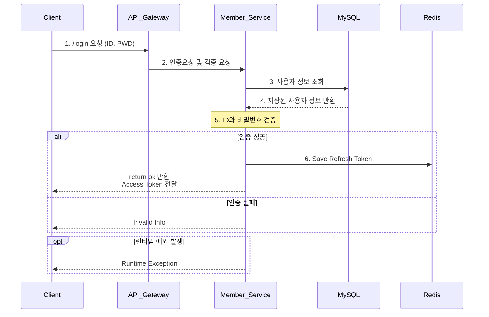
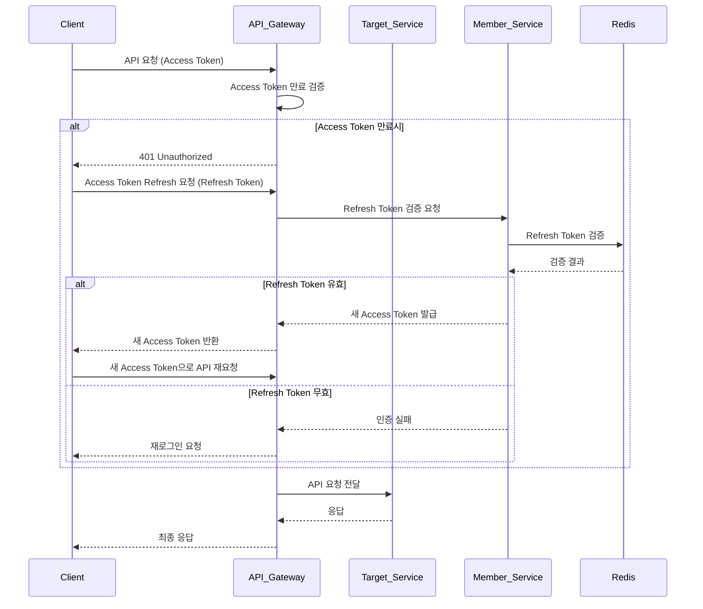

## 로그인 시퀀스 다이어그램

1. 클라이언트가 API Gateway 에 로그인 요청을 보낸다.
2. API Gateway 가 Member Service 에 인증 및 검증을 요청한다.
3. Member Service는 MySQL에서 사용자 정보를 조회한다.
4. MySQL 이 저장된 사용자 정보를 Member Service에 반환한다.
5. Member Service는 내부적으로 전달받은 ID와 비밀번호를 DB에서 조회한 정보와 비교하여 검증한다.
6. 인증 결과에 따라 Member Service가 직접 클라이언트에 응답한다 : 
   - 인증 성공: Redis에 리프레시 토큰 저장 후, 클라이언트에 'ok' 반환 및 액세스 토큰 전달
   - 인증 실패: 클라이언트에 유효하지 않은 정보 반환
7. 런타임 예외 발생 시 Member Service가 클라이언트에 직접 예외를 반환한다.

## 타 서비스 API 요청에 대한 검증 프로세스

### API 요청 및 인증 시나리오

1. 클라이언트가 Access Token과 함께 API 요청을 API Gateway로 전달한다.
2. API Gateway는 Access Token의 만료 여부를 검증한다.
3. Access Token이 만료된 경우:
   - API Gateway는 클라이언트에게 401 Unauthorized 응답을 전달한다.
   - 클라이언트는 API Gateway로 Access Token을 Refresh하기 위한 요청을 전달한다. (이때 Refresh Token을 함께 포함한다.)
   - API Gateway는 이 요청을 Member Service로 전달한다.
   - Member Service는 Redis에서 Refresh Token의 유효성을 검증한다.
   
4. Refresh Token이 유효한 경우:
   - Member Service는 새로운 Access Token을 발급한다. (새로운 Refresh Token은 저장하지 않는다.)
   - 클라이언트는 새 Access Token으로 API 요청을 다시 전달한다.

5. Refresh Token이 무효한 경우:
   - 클라이언트에게 재로그인을 요청한다.

6. Access Token이 유효하거나 재인증이 완료된 후:
   - API Gateway는 Target Service에 API 요청을 전달한다.
   - Target Service는 응답을 반환한다.
   - API Gateway는 클라이언트에게 최종 응답을 전달한다.
